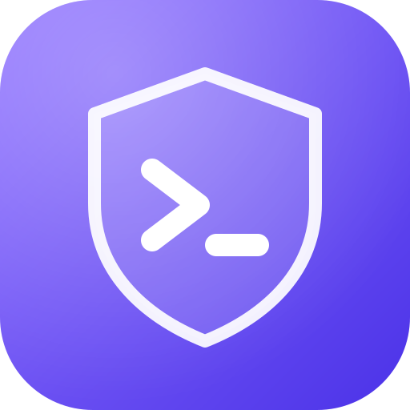

# SSHVault

**An SSH client for people who live in terminals, with an encrypted vault you
sync yourself.**

Hosts, keys, credentials, tunnels and snippets are encrypted on your computer
and synced through a folder you already use (Dropbox, OneDrive, Nextcloud,
Syncthing, iCloud Drive). There's no account and no server, and the sync
service only ever stores ciphertext.

**[Download](https://github.com/aliysefian/termius/releases/latest)** ·
[Guide](docs/USAGE.md) ·
[Changelog](CHANGELOG.md) ·
[Security design](docs/vault-architecture.md) ·
[Roadmap](ROADMAP.md)

Linux and Windows · Built with Rust, Tauri, Svelte and xterm.js

---

## Why SSHVault

- **Your data, your sync.** Every host, key and password lives in an
  encrypted folder. Put it in Dropbox or Syncthing and every computer you use
  has the same hosts. You don't need to trust the sync provider, and there's
  no subscription.
- **Built for real fleets.** Groups with shared credentials and bastions,
  production guard rails, running a command on fifty hosts at once, tmux-aware
  terminals, and a scriptable CLI.
- **Serious about keys.** A Key Manager with certificates and a built-in SSH
  agent, so `git` and `ssh` can use your vault keys with nothing written to
  disk. Server fingerprints are trusted explicitly and shared across devices.
- **Imports what you already have**: `~/.ssh/config`, `known_hosts`, Ansible
  inventories, PuTTY, MobaXterm, and CSV exports from other tools.

## Features

### Terminal
- Tabs that stay connected in the background, up to six split panes per tab,
  pane maximize, and synchronized typing across panes
- A status bar for the vault, SSH agent, CLI and tunnels; tabs show unread
  output, a running command or a bell while in the background, with a
  searchable tab list once they overflow the strip
- Find, clickable links, copy on select, WebGL rendering, Ctrl+scroll zoom
- Themes, including imported VS Code, Windows Terminal and iTerm2 schemes
- Works with tmux and vim: select text while they own the mouse, scroll
  full-screen programs with the wheel, and let tmux, Claude Code and Neovim
  copy to the clipboard (OSC 52)
- Shell integration: current directory in the header, jump between prompts,
  copy the last command's output, notifications when long commands finish
- Smart completion (off until you turn it on): a faint suggestion from your own
  history, and a list of subcommands, options, file names on the host and
  snippets; stays out of vim, tmux and password prompts
- Session recording, local shell tabs (pick the shell, including WSL
  distributions on Windows), Telnet and serial consoles
- Mosh for hosts that need it: roaming and sleep-proof sessions, using the
  system's `mosh-client` after logging in with your vault keys

### Hosts and connections
- Nested groups with default credentials, bastions, proxies and environments
- Favorites, tags, custom fields, Markdown notes, search, filters and bulk edit
- Jump-host chains, SOCKS5/HTTP proxies and ProxyCommand, agent and X11
  forwarding, keep-alive, auto-reconnect
- Remote Desktop (RDP) hosts open in a tab beside your terminals, with
  keyboard, mouse, wheel and shared clipboard text, and the server's
  certificate pinned like an SSH host key
- Quick connect (`user@host:port`), command palette, "copy as `ssh`
  command", reachability check
- A Fleet view: a tile per host with reachability colour-coding and
  auto-refresh, plus opt-in CPU, memory, disk, load and uptime for any
  host, sampled over SSH with nothing installed on it
- A detail view per host: 15-minute charts of CPU, memory and network
  throughput (in memory only), sortable processes with Terminate and a
  separate Force kill, listening ports with their owners, and interfaces
  with addresses and state; macOS and BSD show what they can

- Operations: follow logs on several hosts at once with filters and highlighting,
  manage systemd services (with a typed-name guard on production), and optional
  alerts for hosts that stop answering or run hot; monitoring charts can be kept
  for a day or a week

### Databases
- Browse and query MySQL, MariaDB and PostgreSQL from the same app: saved connections
  (password in the vault), a tree of databases, tables, columns and indexes,
  a query editor with history, and results that stay fast with 100,000 rows
- Reach a database through one of your SSH hosts, so its port is never
  exposed; cancel running statements; export as CSV, TSV or JSON
- Edit a cell in place after seeing the exact `UPDATE`; destructive
  statements ask first, and production connections make you type their name

### Containers
- List, start, stop, restart, remove, inspect and open a shell in the
  containers of Docker, Podman or nerdctl, on this computer or on any saved
  host, with nothing installed on the host
- Follow logs with search, highlight and copy; auto-refreshing lists that
  can be paused; production hosts ask you to type their name first
- Docker: pull and remove images, volumes and networks, see what uses each,
  preview exactly what an "unused" cleanup would remove, and act on Compose
  projects as a whole

- Kubernetes: pods across contexts and namespaces with status colours, followed
  logs, describe, a shell in a pod, and port-forwards, using the kubectl you
  already have (no agent, no kubeconfig import)

### Keys and credentials
- Generate Ed25519, ECDSA and RSA keys; import OpenSSH, PEM, PKCS#8 and PuTTY
  keys; OpenSSH certificates
- Credentials are separate from hosts: rotate a key once and every host using
  it follows
- **Built-in SSH agent**: `ssh`, `git` and your editor use vault keys, with
  per-key "ask every time" approval, also over agent forwarding
- Server keys are trusted explicitly (old and new fingerprints shown if one
  changes) and synced across devices

### Files, tunnels and automation
- Dual-pane file browser with drag and drop, a transfer queue with pause,
  resume and replace/skip/keep-both choices, quick look, chmod, and editing
  remote files in your local editor. It speaks SFTP, SCP (for servers with
  SFTP turned off) and FTP/FTPS with pinned certificates
- Local, remote and SOCKS tunnels, searchable, with one-click start, stop and
  "open in browser"
- Snippets with folders, tags and `{{variables}}`; run them on many hosts and
  compare the output
- CLI: `sshvault list`, `sshvault connect web-01`,
  `sshvault run --group Production -- uptime`

### Safety
- Confirmation for multi-line pastes and destructive commands (`rm -rf /`,
  `DROP TABLE`, `terraform destroy`…) on production hosts, plus red
  production banners
- A paste that looks like a private key or an API token asks first
- Undo for deletes, auto-lock, and clipboard clearing for copied secrets
- Encrypted automatic backups, restore, integrity checks, sync-conflict
  resolution
- A Security review page: certificate expiry, weak or ageing keys, and
  passwords worth rotating, checked locally; a local connection log
- Reopen the tabs that were open last time, after unlocking

## Install

Download the file for your system from the
**[latest release](https://github.com/aliysefian/termius/releases/latest)**:

| System | File | Install |
|---|---|---|
| Windows 10/11 | `SSHVault_…_x64-setup.exe` | Run it. |
| Windows (managed) | `SSHVault_…_x64_en-US.msi` | Run it, or deploy it with your tools. |
| Debian, Ubuntu, Mint, Pop!_OS | `SSHVault_…_amd64.deb` | `sudo apt install ./SSHVault_*_amd64.deb` |
| Fedora, RHEL, openSUSE | `SSHVault-…x86_64.rpm` | `sudo dnf install ./SSHVault-*.x86_64.rpm` |
| Any Linux | `SSHVault_…_amd64.AppImage` | `chmod +x SSHVault_*.AppImage` and run it. |

- **Windows:** the installers aren't code-signed yet, so SmartScreen may
  warn: choose **More info → Run anyway**. The WebView2 runtime is already
  part of Windows 10 and 11, and the installer fetches it if it's missing.
- **Linux:** the packages need glibc 2.35 or newer (Ubuntu 22.04 and later).
- **Updates:** new versions appear on the
  [releases page](https://github.com/aliysefian/termius/releases). In-app
  updates for the AppImage and Windows builds are built in and switch on
  once signed updates are published.

## Get started

1. **Create a vault.** Start SSHVault, choose **Create New Vault**, put it
   inside a folder you sync (for example `~/Dropbox`), and pick a master
   password. **Store the recovery key it shows you somewhere safe and
   offline.** It's the only way back in if you forget the password.
   (**Import SSH Config** does the same and then brings in `~/.ssh/config`.)
2. **Add hosts.** Click **+**, or import from `~/.ssh/config`, Ansible,
   PuTTY, MobaXterm or a CSV. Double-click a host to connect.
3. **Use it on another computer.** Once your sync service has copied the
   folder, choose **Open Existing Vault**, pick the same folder and enter the
   same password. Changes show up on your other computers within seconds.

> [!IMPORTANT]
> The master password is never stored anywhere. Without it or the recovery
> key, nobody can open the vault, including you.

The **[guide](docs/USAGE.md)** covers every feature, and the
**[vault guide](docs/vault-user-guide.md)** covers backups, sync conflicts,
moving a vault and recovery.

## Security

- **What your sync service sees:** random file names, how many records of
  each type there are, their sizes and when they change. Never host names,
  users, addresses, keys, passwords, snippets or anything that unlocks the
  vault.
- **How it's encrypted:**
  - A random 256-bit vault key, unlocked by your master password through
    Argon2id or by the recovery key.
  - Every record is encrypted separately with XChaCha20-Poly1305 and bound to
    its vault and ID, so tampered or swapped files are rejected.
  - Writes are atomic, and a crash never leaves a half-written record.
- **On your computer:** secrets stay in the Rust backend and the interface
  sees redacted copies. The vault key is wiped when it locks. "Remember on
  this device" uses the OS keychain and never stores the password.
- **Not protected:** a computer that is already compromised while the vault
  is unlocked. No password manager can protect you from that.

The full design, threat model and security review are in
[docs/vault-architecture.md](docs/vault-architecture.md). To report a
vulnerability, see [SECURITY.md](SECURITY.md).

## Status

SSHVault is young. The SSH engine, vault, agent and sync are covered by more
than 150 automated tests, many of them end to end against a real OpenSSH
server, but the app hasn't had wide real-world use yet. Keep backups of
anything important, and please
[report problems](https://github.com/aliysefian/termius/issues).

**Not available yet:** macOS builds, code-signed installers, hardware
security keys and team sharing. See the [roadmap](ROADMAP.md).

## Contributing

Bug reports, ideas and pull requests are welcome. See
[CONTRIBUTING.md](CONTRIBUTING.md), and
[docs/DEVELOPMENT.md](docs/DEVELOPMENT.md) for building, testing and how the
code is organized.

## License

[MIT](LICENSE) © Ali Yousefian
